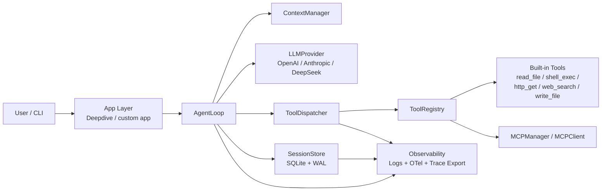

# agent-core

面向 Agent / LLM 应用的 Python runtime 内核。

它不是“再包一层 SDK”的 demo，而是把多 Provider 适配、工具调用、上下文压缩、会话恢复、可观测性和 CLI 这些 Agent 运行时真正会遇到的问题，拆成了可演进的边界。

## Why

当一个项目从“能调模型”走向“能稳定跑 Agent”时，通常会遇到几类结构性问题：

- 业务层被 OpenAI / Anthropic 等厂商协议直接污染，换模型成本很高。
- 工具调用只是“模型返回的一段 JSON”，没有权限、顺序和失败语义。
- 长任务的消息历史不断膨胀，token 成本和 context window 风险一起上升。
- 进程一旦退出，运行中的 agent 无法恢复，也无法重放执行过程。
- 日志、trace、成本统计和业务事件各记一套，最后谁都对不上。

`agent-core` 的目标就是把这些问题收敛成一个本地优先、Provider 中立、可恢复、可观测的 Agent runtime。

## Architecture



## Core Features

- Provider 中立的数据模型：统一 `Message`、`ToolUseContent`、`ToolResultContent`、`CompletionResponse`、`StreamEvent`，上层不直接依赖厂商 SDK 类型。
- 多 Provider 适配：当前已接入 OpenAI、Anthropic、DeepSeek，并通过 `build_provider(...)` 统一构建。
- ReAct 风格运行时：`AgentLoop` 负责 step 循环、预算控制、工具闭环、流式输出重建和 stop reason 管理。
- 工具权限与调度：`ToolDispatcher` 将 `read_only` 工具并发执行，`write` / `dangerous` 工具串行执行，并通过白名单限制能力暴露。
- 长任务上下文压缩：`ContextManager` 以“原子消息组 + middle summary + recent tail”策略控制 token 增长，同时保留工具调用结构。
- 可恢复会话：`SessionStore` 基于 SQLite + WAL 持久化 `sessions / messages / events`，支持从稳定 step 边界恢复。
- 可观测性：结构化日志、OpenTelemetry span、token / cost 统计，以及离线 trace 查看与 JSON 导出。
- MCP 客户端接入：通过 `MCPManager` / `MCPClient` 启动外部 MCP server 并把工具注册到同一个 runtime。
- Demo app：内置 `deepdive` 研究型 agent，展示“检索 -> 抓取 -> 写报告 -> 输出来源附录”的完整运行链路。

## Quick Start

### 1. 安装依赖

```powershell
uv sync
```

### 2. 运行测试

```powershell
uv run pytest
```

### 3. 配置环境变量

至少配置一个 Provider 的 API Key：

```powershell
$env:OPENAI_API_KEY="..."
$env:ANTHROPIC_API_KEY="..."
$env:DEEPSEEK_API_KEY="..."
```

### 4. 运行一个 deepdive agent

```powershell
uv run agent-core deepdive "总结 MCP 对 Agent Runtime 的价值" --provider anthropic --output-dir ./out
```

执行后你会得到：

- `out/report.md`：最终报告
- `agent.db`：SQLite 会话与事件库
- 可用 `trace` / `sessions` 命令离线查看运行过程

### 5. 查看会话和 trace

```powershell
uv run agent-core sessions --db ./agent.db
uv run agent-core trace <session_id> --db ./agent.db
uv run agent-core export-trace <session_id> --db ./agent.db --output ./trace.json
```

## 项目结构

```text
agent-core/
├─ agent_core/
│  ├─ apps/
│  │  └─ deepdive/
│  ├─ cli/
│  ├─ context/
│  ├─ mcp/
│  ├─ observability/
│  ├─ persistence/
│  ├─ providers/
│  ├─ runtime/
│  ├─ testing/
│  ├─ tools/
│  └─ types.py
├─ docs/
│  ├─ adr/
│  ├─ blog/
│  └─ resume/
└─ tests/
```

## 关键模块

- [`agent_core/types.py`](./agent_core/types.py)：Provider 中立的数据模型和流式事件协议。
- [`agent_core/runtime/loop.py`](./agent_core/runtime/loop.py)：运行时主循环、预算控制、session 接入和流式重建。
- [`agent_core/runtime/dispatcher.py`](./agent_core/runtime/dispatcher.py)：工具权限控制与并发/串行调度。
- [`agent_core/context/manager.py`](./agent_core/context/manager.py)：上下文压缩策略。
- [`agent_core/persistence/session_store.py`](./agent_core/persistence/session_store.py)：SQLite 持久化与恢复。
- [`agent_core/observability/`](./agent_core/observability/)：日志、OTel tracing、价格估算和 trace 导出。
- [`agent_core/mcp/`](./agent_core/mcp/)：MCP 客户端与工具注册。
- [`agent_core/apps/deepdive/`](./agent_core/apps/deepdive/)：研究型 agent 示例。

## ADR

推荐先读这 5 篇：

- [ADR-001：为什么需要自定义 Provider 抽象](./docs/adr/001-why-custom-provider-abstraction.md)
- [ADR-005：工具权限模型与并发调度](./docs/adr/005-tool-permission-model-and-concurrent-dispatch.md)
- [ADR-007：Context 压缩策略](./docs/adr/007-context-compression-strategy.md)
- [ADR-008：Session 持久化设计](./docs/adr/008-session-persistence-design.md)
- [ADR-010：可观测性架构](./docs/adr/010-observability-architecture.md)

完整索引见 [docs/adr/README.md](./docs/adr/README.md)。

## 适合用它做什么

- 做一个本地优先、可追踪、可恢复的 Agent runtime 原型。
- 验证多 Provider 统一抽象，而不是一开始就绑定单一 SDK。
- 把工具调用、session 恢复和 trace 展示这些“非 happy path”能力尽早做进架构。
- 作为后续 Router、Retry、Sandbox、Planner / Executor 分层的基础内核。

## 不打算解决什么

- 不追求成为“大而全”的 Agent framework。
- 不内置工作流编排 DSL。
- 不假设必须依赖云端 trace backend 才能调试。

如果你想看这套 runtime 设计背后的权衡，而不仅是 API 用法，优先读 README 里的 5 篇 ADR。
